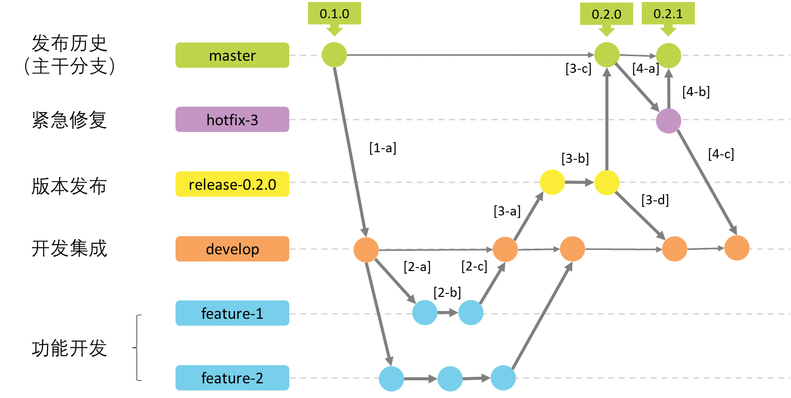

### Git flow 分支管理

Git flow分支管理策略是一种Git版本控制工作流（分支策略管理模型），规定了使用`master`分支来管理发布历史，用`develop`分支来作功能代码集成；使用`feature`分支来作功能开发，使用`release`分支来作版本发布，使用`hotfix`分支来作生产环境缺陷紧急修复。

#### Git flow分支管理策略工作流如下：

#### Git flow 分支说明

- 生产分支 **`master`**

  Master分支是仓库的主分支，也有人叫Production分支，这个分支包含最近发布到生产环境的代码，最近发布的Release， 这个分支只能从其他分支合并，不能在这个分支直接修改‌

- 开发分支 **`develop`**

  开发集成分支，用来集成功能开发代码。 

- 补丁分支 **`hotfix`**

  当我们在生产环境发现新的Bug时候，我们需要基于`master`分支创建一个`hotfix`分支，然后在`hotfix`分支上修复bug，完成hotfix后，我们要把`hotfix`分支合并回`master`和`develop`分支‌，所以`hotfix`的改动会进入下一个Release

- 发布分支 **`release`**

  当你需要发布一个新功能的时候，要基于Develop分支创建一个Release分支，在Release分支测试并修复bug，完成release后，把release合并到master和develop分支‌

- 功能分支 **`feature`**

  开发人员按功能开发的要求从develop分支基础上创建出feature分支，feature分支命名为：feature-<item_id>，item_id为项目管理软件上的任务ID。比如项目管理软件有一个任务ID为1，则需要在develop分支基础上创建出feature-1分支来开发该任务的功能。

  在某个`feature`分支开发完成且评审通过后，代码评审者将该`feature`分支合并进`develop`分支，并删除该`feature`分支。

​	   每个任务一条`feature`分支,不允许将`feature`分支直接合并进`master`分支

#### Git flow 分支使用

1. 当我们创建git仓库之后，默认会创建一个master分支，由于master分支时用于发布生产环境，必须保证master代码的稳定性，所以我们不能直接在master分支上进行修改提交。我们要基于master分支创建一个develop分支。master分支和develop分支是常驻分支。
2. 当新的开发任务来了之后，确保develop分支的稳定性，所以我们要基于de velop分支创建一个临时的feature分支，在feature分支上进行编写代码，等功能开发完成之后，再把开发分支合并到develop分支上。并删除feature分支
3. 新功能合并到develop分支之后，我们想把新功能发布到生产环境上，首先基于develop分支创建release分支，然后在release分支测试完成之后，再把release分支合并到develop分支和master分支
4. release分支合并到master分支之后，在master分支上打标签用于发布
5. 我们把代码发布到生产环境之后，用户在使用过程中反馈的bug，这是我们需要基于master分支创建一个hotfix分支，用于修复bug，bug修复好了之后，在把hotfix分支分别合并到master分支和develop分支

